# __Migration of Database from EC2 to RDS (IAAS to PAAS)__

## Aim of Project
* To ensure automatic backups and high availabilty of data
* To undestand the difference between Iaas and Paas
* To learn how to migrate data from EC2 MySQL to RDS MySQL
* To see how RDS makes database management easier.
## Introduction
In this mini project, a database migration was performed from an EC2 instance to an Amazon RDS instance using the MariaDB engine.
The goal was to move the Myntra database from a self-managed EC2 server to a fully managed RDS service for better scalability, security, and easy maintenance.

### Step 1: Create Amazon RDS (Paas)

1. Click on create database
   
   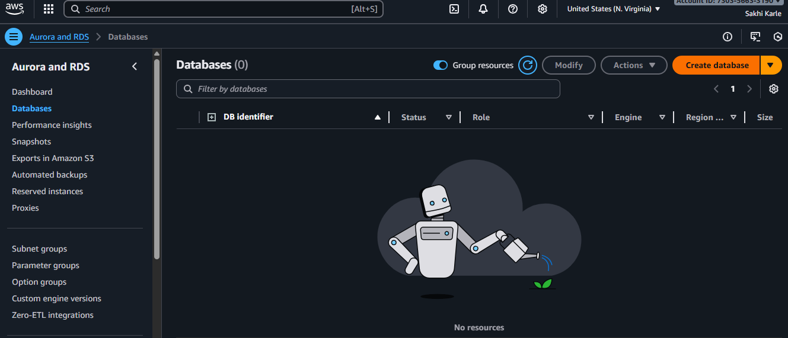
2. Select database creation method and engine type

   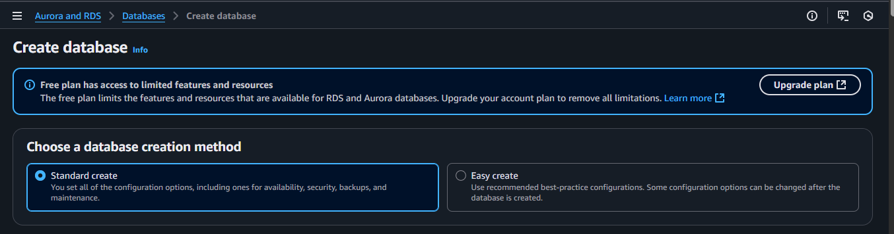
   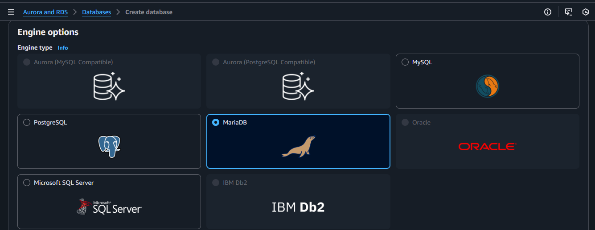
3.Give name for your db instance and select security group
   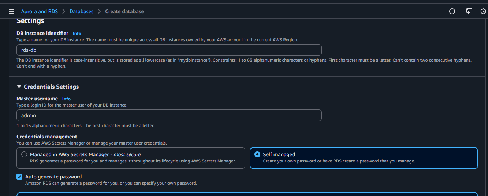 
   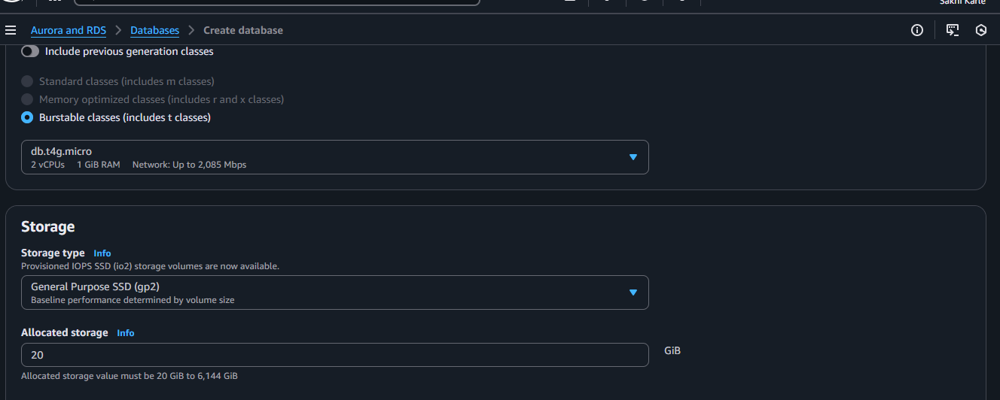 
   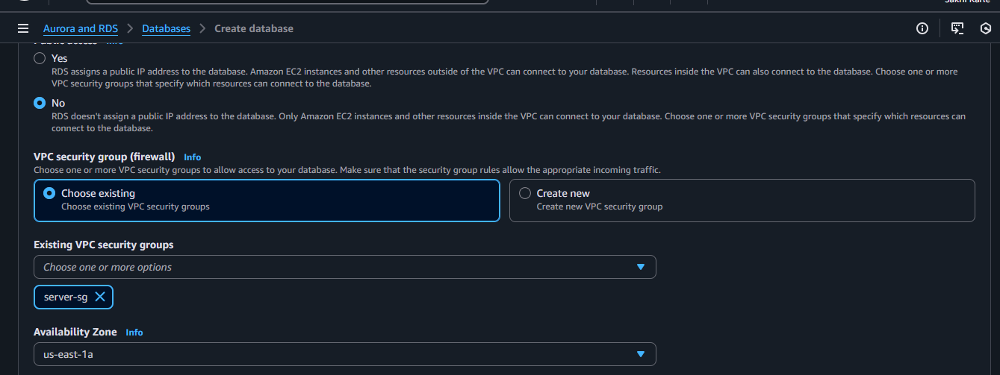

4. Go to Additional configuration and give name your database(Myntra) and click on create database
   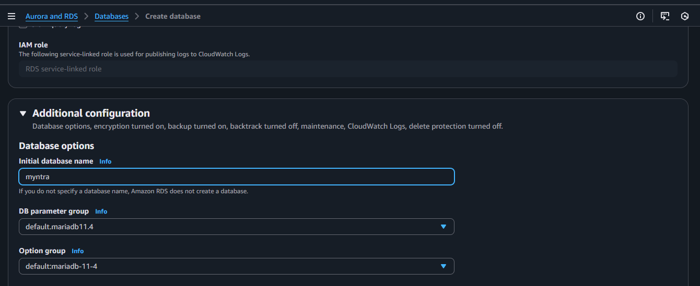
   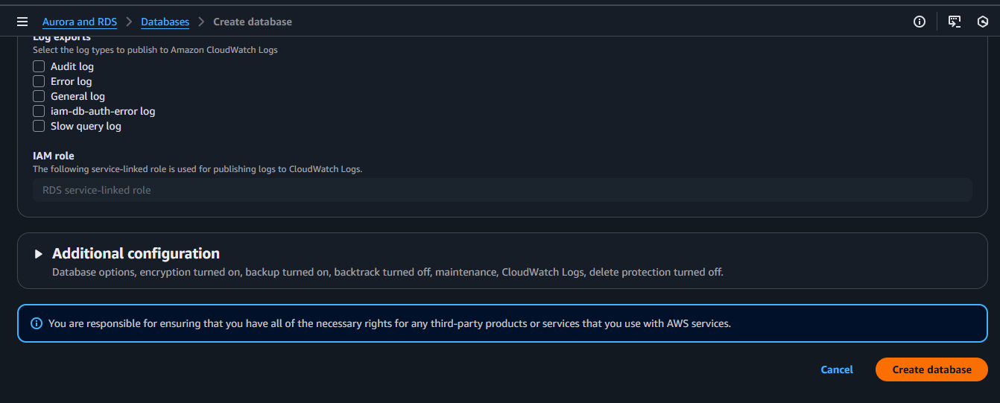

### Step 2: Create Database on EC2(Iaas)
1. Launch and temporary EC2 instance
   
2. Copy ssh and take access of your EC2 instance
 
   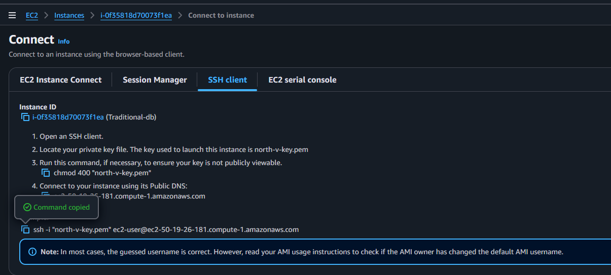
   
3. Install and start mariadb105-server
 
   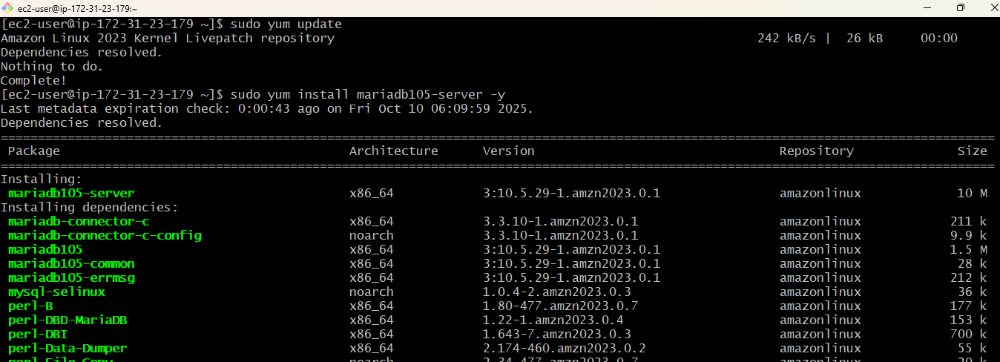
   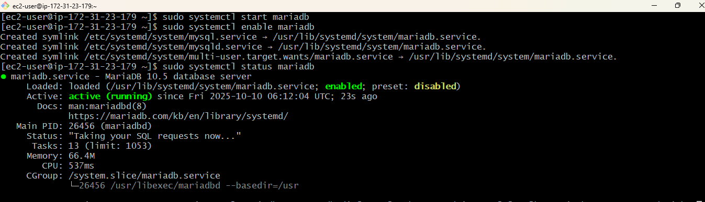
4. Go to mysql
 
   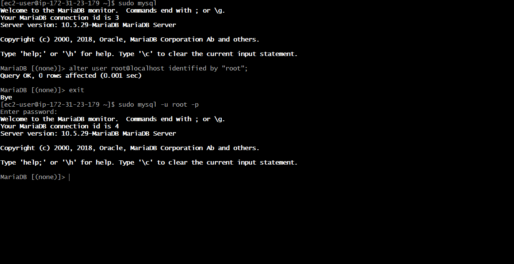
5. Create database myntra and create table and insert values into table
   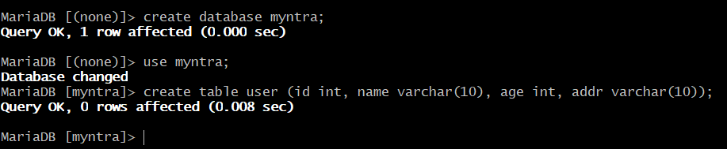
   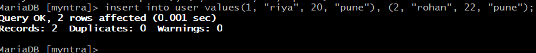

### Step 3: Extract data from EC2 server to convert into file
   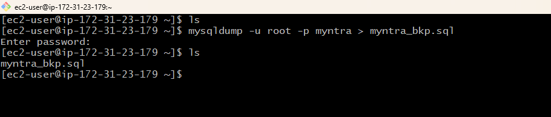
### Step 4: Migrate data from EC2 to RDS
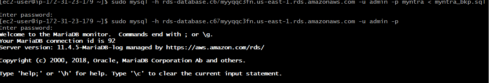
### Step 5: Check the imported database from myntra database

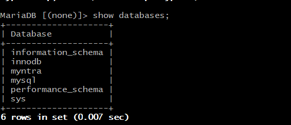
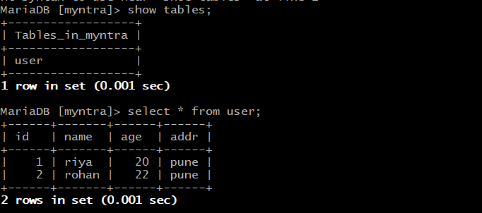

Conclusion:

The migration of the Myntra database from the EC2 instance to Amazon RDS was completed successfully.
All database tables and records were verified and found to be correctly transferred.
By using Amazon RDS, we no longer need to manage database maintenance manually — it saves time, provides automatic backups, and makes scaling much easier when needed.
